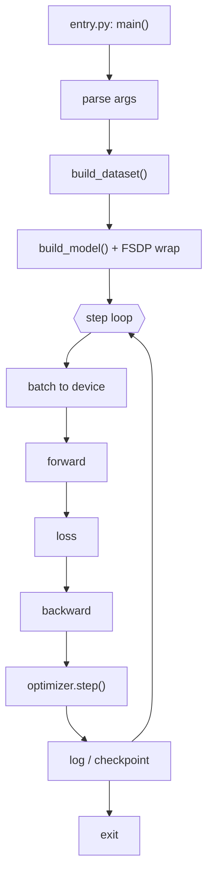

# CODEFLOW.md template

Skeleton for the walkthrough doc. Keep the section order — it matches the order someone
needs the information when sitting down to step through code for the first time.

---

# <System> code flow

One or two sentences: what this run does, and what stepping through it will teach.

## The command

**Verified:** how you know it works — prior run, launch script, doc, or self-verified
smoke. State the level plainly. If unverified, say that here, first.

```bash
# the real command
```

**Debug form** — `<config name>` in `.vscode/launch.json`:

```bash
# what the debug config runs: single process, shrunk workload
```

What changed and why: launcher stripped so one process instead of N; steps/batch reduced
so a full pass takes seconds. Note that output at these settings is not meaningful.

## Flow diagram



<!-- ASCII version: readable in a terminal, a diff, or pasted into chat -->

```
  entry.py: main() .............. BP 1
        |
  parse args ..................... BP 2
        |
  build_dataset() ................ BP 3
        |
  build_model() + FSDP wrap ...... BP 4
        |
  +---> step loop ................ BP 5  (step == 0)
  |     |
  |   batch to device ............ BP 6
  |     |
  |   forward .................... BP 7
  |     |
  |   loss ....................... BP 8
  |     |
  |   backward ................... BP 9
  |     |
  |   optimizer.step() ........... BP 10
  |     |
  |   log / checkpoint ........... BP 11
  +-----+
        |
      exit
```

## How it works

Prose over the diagram, naming real files and functions. Explain what each stage is *for*,
not the call order the diagram already shows. Call out anything surprising: an argument
that silently overrides another, a branch selected by config, a value that must match
between two places.

## Breakpoints

| # | Location | Guard | What to look at |
| --- | --- | --- | --- |
| 1 | `entry.py:42` | | Raw argv before anything normalises it |
| 5 | `train.py:180` | `step == 0` | First iteration, with the batch in scope |
| 7 | `model.py:95` | `hitCondition ==1` | Input shapes and dtypes entering the model |
| 9 | `model.py:210` | **disabled** | Per-layer; enable with a hit count or you stop hundreds of times |

One row per breakpoint. The last column is the value of the whole table — say what to
inspect and why it matters, not what the line does.

## Suggested first pass

Stepping all of them at once is a lot. A shorter route that still shows the shape:

1. **BP 2** — the resolved configuration; now you know what is actually being asked for
2. **BP 3** — what one sample looks like
3. **BP 5 → 7 → 8** — one full step, start to finish
4. **BP 11** — what gets persisted

## Gotchas

Things that silently produce wrong behaviour: flags that override each other, formats that
must match across components, paths that are not restart-persistent, settings whose failure
mode looks like a different bug.

## Not covered

Paths deliberately excluded and why — other entry points, distributed-only code, alternate
model variants. Stating this makes absence a decision rather than an oversight.
